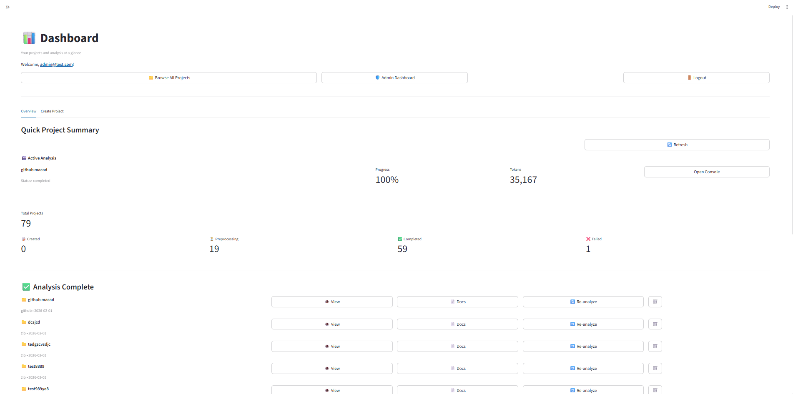
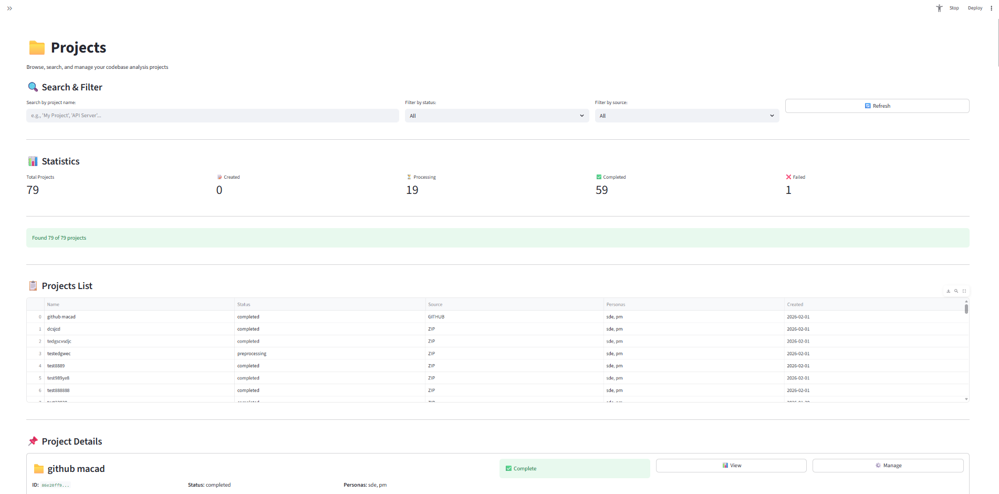
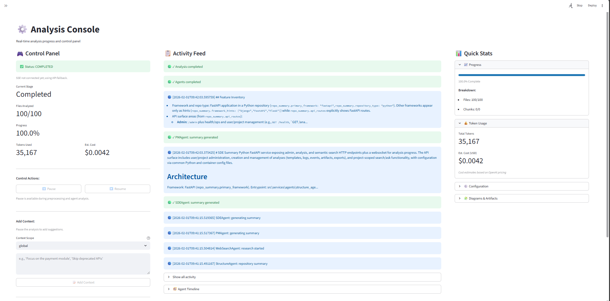
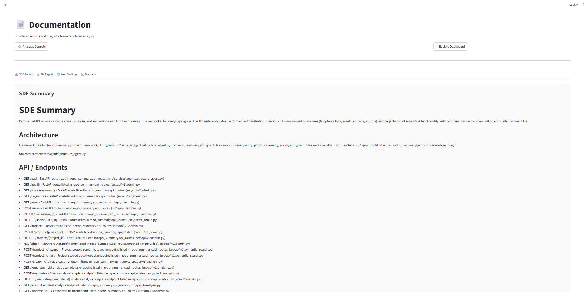
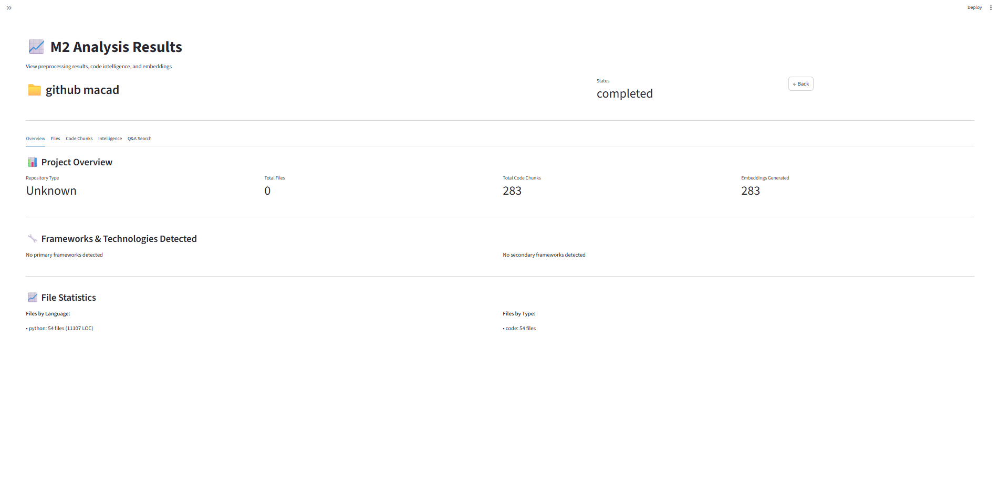

# maCAD System — UI Navigation Guide

Quick guide to the Streamlit app. Add screenshots in the `screenshots/` folder and link them below (e.g. `screenshots/home.png`).

---

## 1. Home

**URL:** `http://localhost:8501` (app root)

- **Logged out:** Shows what maCAD does, how it works, and **Login** / **Sign Up** buttons.
- **Logged in:** Shows a success message and **Go to Dashboard**.

---

## 2. Login / Sign Up

**Page:** Login (sidebar or **1_Login**)

- **Sign Up:** Create an account (email, password).
- **Login:** Sign in with existing credentials.
- After login you are redirected to the app; use the sidebar to move between pages.

---

## 3. Dashboard

**Page:** Dashboard (**2_Dashboard**)

- **Create Project** tab: Upload a ZIP or enter a GitHub URL, choose personas (SDE, PM, or both), then create the project.
- **My Projects** tab: List of your projects; open one to start or view an analysis.

---

## 4. Projects

**Page:** Projects (**4_Projects**)

- View and manage your projects.
- Start a new analysis from a project or open an existing analysis.

---

## 5. Analysis Console

**Page:** Analysis Console (**4_Analysis_Console**)

- **Progress:** Live status and stage (preprocessing, agent orchestration, etc.).
- **Pause / Resume:** Control a running analysis (with optional timeout).
- **Activity feed:** Recent events and logs.
- **Q&A:** Ask questions about the codebase; answers include file and line citations.

Open this page from a project when an analysis is running or completed.

---

## 6. Documentation

**Page:** Documentation (**5_Documentation**)

- **SDE Report:** Software Engineer–focused documentation.
- **PM Report:** Product Manager–focused summary.
- **Web Findings:** Results from optional web search during analysis.
- **Diagrams:** Architecture and sequence diagrams (Mermaid).
- **Export:** Download as PDF or Markdown.

Use **View Documentation** from the Analysis Console when an analysis is complete.

---

## 7. Results

**Page:** Results (**3_Results**)

- High-level view of analysis results and links to detailed documentation.

---

## 8. Admin Dashboard

**Page:** Admin Dashboard (**6_Admin_Dashboard**)

- **Access:** Admin users only (e.g. created via `scripts/seed_admin.py`).
- **Tabs:** Overview, Users, Projects, Analyses, Errors.
- Use for system health, user/project management, and error logs.

---

## Navigation summary

| Page            | Purpose                                      |
|-----------------|----------------------------------------------|
| Home            | Landing; login or go to Dashboard            |
| Login           | Sign up / Sign in                            |
| Dashboard       | Create project, see My Projects              |
| Projects        | Manage projects, start or open analysis      |
| Analysis Console| Progress, pause/resume, Q&A                  |
| Documentation   | SDE/PM reports, diagrams, export             |
| Results         | Summary of results                           |
| Admin Dashboard | Admin-only overview and management          |

---

*Add your screenshots to a `screenshots/` folder and replace the placeholders above with e.g. ``.*
